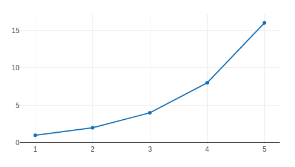
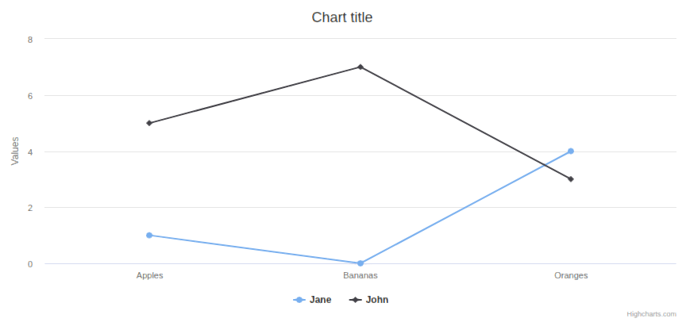
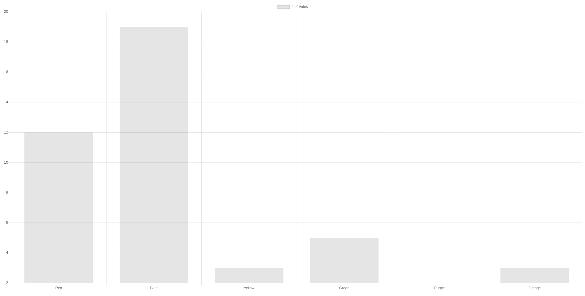

# Basics of Building Widgets {#widgets-basics}

Having explored existing packages that build on top of the htmlwidgets package gives some idea of the end product but much of how it works and where to start probably remains somewhat mysterious. 

## Read & Study {#widgets-basics-study}

Once you have found an interesting library that you would like to use from R, the very first step when building a widget is to thoroughly study the JavaScript library one wants to integrate. Often one will overlook this step only to pay it back dearly later on.

1. Start where the documentation tells you to start, often a "hello world" example, or a get-started section. This will already give you a good sense of how this library functions, the expected data format, and more.
2. Second it's good to head to the "installation" part of the documentation to know more about the library's dependencies, see whether it is modularised or available in a single bundle, etc.
3. Look at examples in more depth, you've likely already taken a look at some but observe the source code of those in more details. One cue to know if the library will be more or less complex to integrate with R is whether the various snippets of code that generate the examples are similar or drastically different: commonalities make for easier abstractions and ultimately simpler R code and packages. Some libraries will ultimately be easier to integrate than others.
4. At this stage you should have some idea of what it will take to bring the library to R, and though you likely have some idea of what are the functions and methods that comprise the library from the examples you should look at the "API," or proper "documentation" of the API to grasp exactly what is available.
5. Finally, before starting the R work, it is advised to properly experience using the library as it was intended: with JavaScript and HTML. This will further give a sense of which part of the API are great and which not so much. This is useful to know because you will get to improve or mirror this API in R when you develop the widget for it.

This is likely a section you will want to come back to at the end of this part as you browse for libraries to integrate in your workflow.

## Candidate Libraries {#widgets-basics-candidates}

Before going down the rabbit hole it is good to take a look at the types of libraries one will work with. As htmlwidgets' main clients are JavaScript visualisation libraries let us take a look at some such popular libraries and briefly analyse at how they work and what they have in common. This will greatly help conceptualise what one is trying to achieve in this chapter.

### Plotly.js {#widgets-basics-candidates-plotly}

[Plotly.js](https://plotly.com/javascript/) is probably one of the more popular out there, it provides over 40 fully customiseable chart types, many of which are very sophisticated. This is indeed the JavaScript library used by the R package of the same name: plotly.

Looking at the code presented in the "Get Started" guide reveals just how convenient the library is. One must import plotly, of course, then have a `<div>` where the visualisation will be placed, then, using `Plotly.newPlot`, create the actual visualisation by passing it first the element previously mentioned and a JSON of options that describe the chart.

```html
<!DOCTYPE html>
<html xmlns="http://www.w3.org/1999/xhtml" lang="" xml:lang="">

<head>
  <!-- Import library -->
  <script src="plotly-latest.min.js"></script>
</head>

<body>
  <!-- div to hold visualisation -->
  <div id="chart" style="width:600px;height:400px;"></div>

  <!-- Script to create visualisation -->
  <script>
    el = document.getElementById('chart');
    Plotly.newPlot(el, [{
      x: [1, 2, 3, 4, 5],
      y: [1, 2, 4, 8, 16] }]
    );
  </script>
</body>

</html>
```



Now let's look at how another popular library does it.

### Highchart.js {#widgets-basics-candidates-highcharts}

[Highcharts](https://www.highcharts.com/) is another library which allows creating gorgeous visualisation, maps, and more, it's also very popular albeit not being entirely open-source.

```html
<!DOCTYPE html>
<html xmlns="http://www.w3.org/1999/xhtml" lang="" xml:lang="">

<head>
  <!-- Import library -->
  <script src="highcharts.js"></script>
</head>

<body>
  <!-- div to hold visualisation -->
  <div id="chart" style="width:100%;height:400px;"></div>

  <!-- Script to create visualisation -->
  <script>
    var myChart = Highcharts.chart('chart', {
        xAxis: {
            categories: ['Apples', 'Bananas', 'Oranges']
        },
        series: [{
            name: 'Jane',
            data: [1, 0, 4]
        }, {
            name: 'John',
            data: [5, 7, 3]
        }]
    });
  </script>
</body>

</html>
```



The above is very similar to what plotly.js requires: import libraries, create a `<div>` where to put the visualisation, and, to create the chart, run a function which also takes the id of the div where to place the chart and a JSON of options defining the actual chart, including the data.

### Chart.js {#widgets-basics-candidates-chart.js}

[Chart.js](https://www.chartjs.org/) is yet another library which to draw standard charts popular for its permissive license and convenient API.

```html
<!DOCTYPE html>
<html xmlns="http://www.w3.org/1999/xhtml" lang="" xml:lang="">

<head>
  <!-- Import library -->
  <script src="Chart.min.js"></script>
</head>

<body>
  <!-- canvas to hold visualisation -->
  <canvas id="chart"></canvas>

  <!-- Script to create visualisation -->
  <script>
    var el = document.getElementById('chart').getContext('2d');    
    var myChart = new Chart(el, {
      type: 'bar',
      data: {
        labels: ['Red', 'Blue', 'Yellow', 'Green', 'Purple', 'Orange'],
        datasets: [{
          label: '# of Votes',
          data: [12, 19, 3, 5, 2, 3]
        }]
      }
    });
  </script>
</body>

</html>
```



We again observe a very similar structure as with previous libraries. The library is imported, instead of a `div` chart.js uses a `canvas`, and the visualisation is also created from a single function which takes the canvas as first argument and a JSON of options as second.

Hopefully this reveals the repeating structure such libraries tend to follow as well as demonstrate how little JavaScript code is actually involved. It also hints at what should be reproduced, to some extent at least, using R.

## How it works {#widgets-basics-inner-workings}

Imagine there is no such package as htmlwidgets to help create interactive visualisations from R: how would one attempt to go about it?

As observed, an interactive visualisation using JavaScript will be contained within an HTML document, therefore it would probably have to be created first. Secondly, the visualisation that is yet to be created likely relies on external libraries, these would need to be imported in the document. The document should also include an HTML element (e.g.: `<div>`) to host said visualisation. Then data would have to be serialised in R and embedded into the document where it should be read by JavaScript code that uses it to create the visualisation. Finally all should be managed to work seamlessly across R markdown, shiny, and other environments.

This gives the following basic diagram, it will be broken down further in the next chapter as the first widget is build.

<!--html_preserve--><div id="htmlwidget-6084e4f6191b81b3421d" style="width:100%;height:250px;" class="grViz html-widget"></div>
<script type="application/json" data-for="htmlwidget-6084e4f6191b81b3421d">{"x":{"diagram":"\ndigraph {\n  graph [rankdir = LR]\n\n  subgraph cluster_0 {\n    node [shape=box]\n    \"HTML element\"\n    \"JSON\"\n    \"JavaScript\"\n    \"Dependencies\"\n    label=\"HTML\"\n    color=gold\n  }\n\n  subgraph cluster_1 {\n    node [shape=box]\n    \"Data\"\n    \"Chart options\"\n    label = \"R environment\"\n    color=royalBlue\n  }\n\n  \"Data\" -> \"JSON\" \n  \"Chart options\" -> \"JSON\" [label=\"serialise\" constraint=false]\n  \"JSON\" -> \"JavaScript\"\n  \"JavaScript\" -> \"HTML element\"\n  \"Dependencies\" -> \"JavaScript\"\n}\n","config":{"engine":"dot","options":null}},"evals":[],"jsHooks":[]}</script><!--/html_preserve-->

Thankfully the htmlwidgets package is there to handle most of this. Nonetheless, it is important to understand that these operations are undertaken (to some degree) by htmlwidgets.
